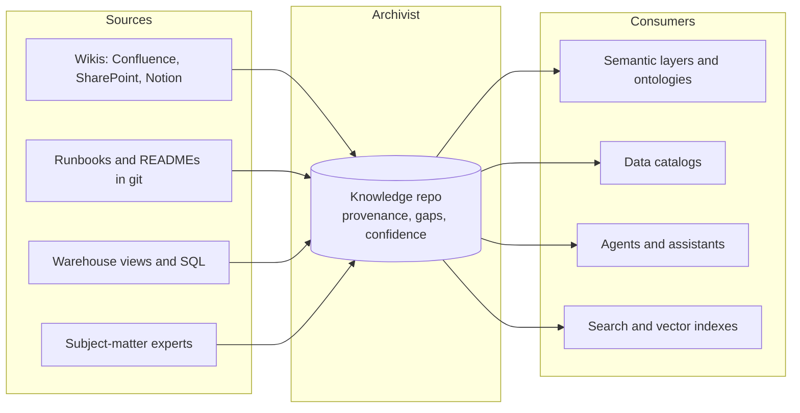
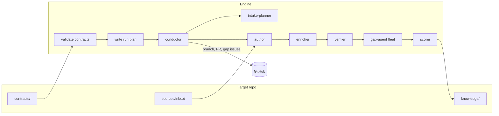

# Archivist

**The system of record for business context.** Archivist compiles the documents your organization
already has (wiki pages, runbooks, data-warehouse views, answers from the people who know) into a
git repository of structured knowledge where every claim cites its source, every missing piece is
recorded as a gap, and every document carries a confidence score. Semantic layers, ontologies,
data catalogs and AI assistants read from it; none of them replace it.

A fixed team of [Claude Code](https://code.claude.com) agents does the authoring, enrichment,
verification, gap-checking and scoring. Your repository's contracts decide what gets written and
how it is judged.


[](LICENSE)


---

## Table of contents

- [Why Archivist](#why-archivist)
- [Where it sits](#where-it-sits)
- [How it works](#how-it-works)
- [Features](#features)
- [Quick start](#quick-start)
- [Usage](#usage)
- [Writing a target](#writing-a-target)
- [Configuration](#configuration)
- [Project structure](#project-structure)
- [Development](#development)
- [Contributing](#contributing)
- [License](#license)

## Why Archivist

Business context is the bottleneck for every agent deployment. Text-to-SQL, analytics copilots
and support assistants all fail the same way: the model is fine, but nobody wrote down what a
"customer case" is, which column is authoritative, or who decides when two documents disagree.
On real enterprise schemas, supplying that context moves accuracy by tens of points; swapping
models moves it by a few.

Every platform now offers to mine your Confluence and Slack and build that context for you.
Each one builds it inside its own product, from whatever it can scrape, with no record of where a
definition came from, no list of what it could not find, and no way to carry it to the next
platform. Buy two and you maintain two.

Archivist takes the other position: **the knowledge is the asset, so it lives in a repository you
own, in a format anything can read, with the audit trail intact.**

What makes a concept Archivist writes different from a page an LLM summarized:

| Property | What it means in the repo |
|---|---|
| **Provenance** | Every concept lists the source documents it was authored from. A correction from a subject-matter expert is itself a cited source, not an anonymous edit. |
| **Gaps are first-class** | What the sources did *not* say is recorded in `okfx_gaps`, rendered in the document, and filed as a GitHub issue routed to an owner. Visible ignorance beats confident silence. |
| **Confidence is computed, not asserted** | `okfx_confidence` follows the repository's own scoring contract, from the gaps that remain. A document with an open high-priority gap cannot score well. |
| **Verified against sources** | A verifier stage restores content the author dropped, resolves conflicts between sources by rule, and removes text no source supports. |
| **Review before publish** | One run, one branch, one pull request. Humans merge. |
| **Open format** | Markdown with [OKF v0.2](https://github.com/GoogleCloudPlatform/open-knowledge-format) frontmatter. Readable by people, by git, and by any downstream tool. |

The engine knows nothing about your domain. The repository's contracts define the document
types, structures, intake rules, gap criteria and scoring:

| | Owns | Lives in |
|---|---|---|
| **Target** (your knowledge repo) | the *what*: document types, structure, intake rules, gap criteria, scoring, reference data | `contracts/` in that repo |
| **Engine** (this repo) | the *how*: a stable team of general-purpose agents and the skills they use | `agents/`, `skills/` |

One engine serves many targets. A new kind of document is a new set of contracts, not an engine
change. A target is pinned to an engine release, so an engine upgrade never changes a
repository's output until that repository opts in.

## Where it sits

Archivist is upstream of the tools that consume business context and downstream of the places it
is written. It is not a semantic layer, a catalog, a vector database or a chat product, and it does
not try to be.



| Consumer | What it takes from the repo | What it adds that Archivist does not |
|---|---|---|
| **Semantic layers and ontologies**: TextQL Ontology, dbt Semantic Layer, Snowflake Semantic Views, Databricks metric views and Genie, Cube, LookML, Palantir Foundry | Definitions, glossary terms, join keys, code sets, business rules, the markdown context their agents read | Metric formulas, query generation, row-level security |
| **Data catalogs**: Alation, Collibra, Atlan, DataHub, Unity Catalog | Descriptions, owners, certified definitions | Lineage from execution, access policy, stewardship workflow |
| **Agents and assistants**: Claude, Copilot, Cursor, in-house agents | Concepts to cite, confidence to report, gaps to escalate | The conversation |
| **Search and vector indexes**: pgvector, Qdrant, LanceDB, enterprise search | Concept text and frontmatter as filterable metadata | Retrieval. The index is derived and disposable; the repo is not. |

None of these formats carries source citations, confidence or a gap ledger. That is why the repo
stays the system of record and the consumers stay consumers.

## How it works



1. **Validate.** The engine loads `contracts/target.yaml` and every contract it declares. It checks
   syntax, JSON Schemas and cross-references, and refuses the run if the chosen pipeline needs a
   contract the target did not declare.
2. **Plan.** It installs the engine's agents and skills into the workspace and writes a run plan:
   the stages in order, and how each one is dispatched.
3. **Run.** The conductor agent follows the plan. It takes each group of inbox documents through
   every stage, updates the catalog, and optionally publishes a branch, a pull request and one
   GitHub issue per gap.
4. **Guard.** A run fails if its first stage never started. Python writes a redacted transcript
   for every sub-agent.

Judgement stays with the agents. Python only validates, prepares and launches.

## Features

- **Contracts are optional by default.** Only `contracts/target.yaml` is required. Everything else
  is needed only when an agent in the pipeline requires it.
- **Your own reference data.** Inventories, owner lists, glossaries or anything else can be
  described in the contract index and read by agents, with no engine change.
- **Pipelines from engine agents.** Targets choose, reorder or drop stages. They cannot ship
  agents of their own.
- **Open Knowledge Format output.** Concepts use [OKF v0.2](https://github.com/GoogleCloudPlatform/open-knowledge-format)
  fields where OKF defines them. Every extension field carries the `okfx_` prefix, and validation
  enforces it.
- **Safe parallel gap checks.** One agent per gap kind runs in parallel. Each verdict goes through
  a locked, YAML-safe `record-gap` command, so concurrent agents can't lose each other's findings.
- **Pinned engine versions.** Each target names the engine release it runs on; a newer engine
  hands the run to the pinned release instead of changing a target's behaviour silently.
- **Published for review.** Each run produces one branch and one pull request, with gap issues
  deduplicated by title across re-runs.

## Quick start

### Prerequisites

- [Docker](https://docs.docker.com/get-docker/), the only runtime (on macOS, `colima start`
  if the daemon is down)
- Model access, either an [Anthropic API key](https://console.anthropic.com/) or an
  Anthropic-compatible gateway such as LiteLLM
- A [`gh`](https://cli.github.com/) login on the host for publishing runs

### 1. Clone and configure

```bash
git clone https://github.com/dfirmin/archivist.git
cd archivist
cp .env.example .env        # pick CLAUDE_AUTH_MODE and fill in its variables
```

### 2. Run the offline tests

```bash
./tests/run.sh
```

### 3. Try the example target

```bash
./scripts/docker-run.sh prepare-target --target sample --local /workspace/sample   # seed the bundle
cp -r examples/warehouse/contracts/. out/workspace/sample/contracts/                # add the example contracts
cp examples/warehouse/sources/inbox/*.md out/workspace/sample/sources/inbox/

./scripts/docker-run.sh validate /workspace/sample --pipeline full
./scripts/docker-run.sh prepare-workspace /workspace/sample   # inspect .claude/ and the run plan

SKIP_PUBLISH=1 \
  INBOX_FILE=sources/inbox/catalog-custcase-essential-information.md \
  ./scripts/run-conductor.sh
```

Results appear under `out/workspace/sample/knowledge/`, and transcripts under `out/transcripts/`.

## Usage

All commands run inside the container through the wrappers in `scripts/`.

| Command | What it does |
|---|---|
| `archivist validate <workspace> [--pipeline P …]` | Check a target's contracts against one or more pipelines |
| `archivist prepare-target --target <slug> [--local] <path>` | Seed an empty repo with the minimal bundle and `contracts/target.yaml` |
| `archivist load-target --target <slug> <path>` | Fresh clone of a registered target, then validate (publisher mode) |
| `archivist prepare-workspace <workspace> [--pipeline P]` | Install agents, skills and the run plan into `.claude/` |
| `archivist run-conductor <workspace> […]` | Run the pipeline (live) |
| `archivist record-gap <concept> --kind K …` | Write one gap verdict (used by gap-agents) |
| `archivist prune-gaps <concept>` | Drop verdicts for kinds the contract no longer has or applies (run before a gap fleet) |
| `archivist smoke-agent` | Prove headless Claude Code can spawn a sub-agent (live) |

Common conductor runs (auth comes from `.env`):

```bash
./scripts/run-conductor.sh                                                        # whole inbox, publish
INBOX_LIMIT=1 SKIP_PUBLISH=1 ./scripts/run-conductor.sh
PIPELINE=gaps SKIP_PUBLISH=1 CONCEPT_FILE='knowledge/…/overview.md' ./scripts/run-conductor.sh
PIPELINE=gaps CONCEPTS=all KINDS=missing_escalation ./scripts/run-conductor.sh             # new or changed gap kind
PIPELINE=rescore CONCEPTS=all ./scripts/run-conductor.sh                                # scoring contract changed
```

When gap kinds or the scoring contract change, published concepts are re-judged without
re-authoring them: `--concept` takes paths or `all`, `--kind` narrows the gap fleet, and
the run may change only `okfx_gaps` and `okfx_confidence` (anything else fails it). Kinds
removed from the contract are dropped from `okfx_gaps`, and their issues closed when a gap
clears. See [ADR 0004](docs/adr/0004-scoped-gap-and-score-runs.md).

`SKIP_PUBLISH=1` leaves git alone. Trusted git operations (`load-target`, remote
`prepare-target`) go through `./scripts/publisher-run.sh`.

## Writing a target

A target is an OKF bundle with a `contracts/` directory:

```
my-knowledge/
├── contracts/
│   ├── target.yaml          # required: slug, pipelines, contract paths, reference data
│   ├── concept-types.yaml   # OKF type, path pattern, structures, okfx_ fields
│   ├── structures/*.yaml    # sections and who owns each one
│   ├── intake.yaml          # scope, grouping, document classes and routing
│   ├── gap-kinds.yaml       # gaps to judge, per concept type
│   ├── scoring.yaml         # confidence rubric
│   └── reference/…          # any data of your own
├── knowledge/               # authored concepts (concept ID = path)
├── sources/inbox/           # documents waiting to be authored
├── sources/processed/       # authored documents, kept for citation
├── sources/quarantine/      # documents behind a quarantined draft
├── quarantine/              # drafts the author could not place, until an owner resolves them
├── index.md  log.md         # OKF reserved files
```

| Contract | Required when the pipeline runs | Default without it |
|---|---|---|
| `concept-types`, `structures` | author, enricher (concept-types also for gap-agent) | none |
| `intake` | never | every document in scope, each authored as its own concept |
| `gap-kinds` | gap-agent, scorer | none |
| `scoring` | scorer | none |
| `catalog`, `publishing` | never | index grouped by type; issue title `{title} — {kind}` |

`prepare-target` seeds a new target with a generic, valid starter set (one `knowledge-article`
concept type, an `article` structure, intake, two gap kinds and scoring), so the full pipeline
runs immediately, plus reference copies of both example targets under `examples/`. Replace the
starters with your own contracts. Re-running `prepare-target` on an existing target opens an
onboarding PR with anything missing (it never overwrites contracts you have declared).

A minimal index:

```yaml
version: 1
slug: policy-notes
engine: v0.3.0                        # the engine release this target runs on
default_pipeline: summarize
pipelines:
  summarize: [author, verifier]       # engine agents only
contracts:
  concept-types: concept-types.yaml
  structures: structures/
```

Three complete examples ship with the engine, each with sample inbox documents:

- [`examples/minimal`](examples/minimal): policy summaries from two contracts.
- [`examples/handbook`](examples/handbook): a team handbook. Intake classes route policies and
  procedures to different concept types; runbooks pick a structure per document by content
  (routine procedure vs incident response); gap checks use the recorded `okfx_structure`.
- [`examples/warehouse`](examples/warehouse): data-warehouse business views, with inventory
  routing, code-extracted logic, glossary checks, a structure chosen by looking up a subject
  area's archetype, scoring and issue publishing, all expressed as contracts.

**[`docs/contracts.md`](docs/contracts.md)** explains every contract and walks through exactly how
a document's concept type and structure are chosen.

Schemas for every contract kind are in [`schemas/contracts/`](schemas/contracts/).

## Engine versions

Every target pins the engine release it runs on, so an engine change never reaches a target
until that target opts in:

```yaml
# contracts/target.yaml
engine: v0.3.0          # a release tag, or a full commit SHA
```

- `prepare-target` writes the pin of a new target (the engine's own release, or `--engine vX.Y.Z`).
- Every command that works on a target (`validate`, `load-target`, `prepare-workspace`,
  `run-conductor`) checks the pin first. If the running engine is a different version, it
  fetches the pinned release from `ARCHIVIST_ENGINE_REPO` (default: this repository), installs
  it once into `ARCHIVIST_ENGINE_CACHE`, and hands the command to it. Agents calling
  `archivist record-gap` during that run use the pinned engine too.
- **Try** another engine for one command with `--engine v0.4.0` (or `ENGINE=v0.4.0` for
  `run-conductor.sh`); `--engine current` uses the installed engine regardless of the pin.
- **Adopt** an upgrade with `prepare-target --target <slug> --upgrade v0.4.0`: it validates the
  target on the new engine and opens a PR that changes only the pin and `examples/`.

Versions come from git tags: the commit tagged `v0.4.0` reports `v0.4.0`, every other commit a
development version that cannot be pinned (pin its commit SHA to test it). Releasing is a button:
Actions → **release** → type the version. [`docs/releasing.md`](docs/releasing.md) has the whole
flow and [`docs/testing.md`](docs/testing.md) how to test unreleased code against a target.

## Configuration

### Model access

Set `CLAUDE_AUTH_MODE` in `.env` (see [`.env.example`](.env.example)):

| Mode | Talks to | Needs |
|---|---|---|
| `anthropic-api` | the Anthropic API directly (`api.anthropic.com`) | `ANTHROPIC_API_KEY` |
| `gateway-key` (default) | a LiteLLM or other Anthropic-compatible gateway | `LITELLM_API_BASE`, `LITELLM_API_KEY`, `LITELLM_MODEL` |
| `local-claude` | whatever your own Claude Code login uses (local dev) | a host `~/.claude-code-auth` apiKeyHelper, `ACT_CLAUDE_MODEL` |
| `inherit` | whatever the installed Claude Code is already signed in to: a `/login`, a subscription token from `claude setup-token` (`CLAUDE_CODE_OAUTH_TOKEN`), or a Claude Code cloud session | nothing; Archivist leaves the environment alone |

```bash
# Direct Anthropic API
CLAUDE_AUTH_MODE=anthropic-api
ANTHROPIC_API_KEY=sk-ant-...
```

In `anthropic-api` mode Archivist removes any gateway URL, bearer token or beta-header
stripping from the environment before starting Claude Code, so a leftover gateway setting can't
silently reroute the run. Gateway mode strips pre-release beta headers, which many gateways
reject. Each agent pins its own model in `agents/*.md`; `ACT_CLAUDE_MODEL` sets the session
default. Run `./scripts/docker-run.sh config-check` to see which endpoint a run will use.

### Harness

Sessions run on Claude Code by default. `ARCHIVIST_HARNESS=pi` runs them on
[Pi](https://pi.dev) instead (ADR 0008): the same agents, skills, contracts and run plan, with an
engine extension providing sub-agents. All four auth modes work on both; on Pi a gateway or key
helper becomes a provider in a generated `models.json`. `inherit` on Pi uses `ANTHROPIC_API_KEY`,
`CLAUDE_CODE_OAUTH_TOKEN` or your own `~/.pi/agent/auth.json`; note that a Claude subscription
login used through a third-party harness draws from extra usage, so prefer `anthropic-api` or a
gateway for Pi.

### Other variables

| Variable | Purpose |
|---|---|
| `ACT_CLAUDE_MODEL` | Default session model (optional in `anthropic-api` mode) |
| `ARCHIVIST_HARNESS` | `claude-code` (default) or `pi` |
| `ARCHIVIST_PI_BIN` | Pi harness only: the `pi` executable (default `pi` on `PATH`) |
| `ANTHROPIC_BASE_URL` | Gateway mode only: a local proxy in front of the gateway |
| `GITHUB_TOKEN` | Used by the conductor for publishing (or the mounted `gh` login) |

`run-conductor.sh` also reads `TARGET_SLUG`, `WORKSPACE`, `PIPELINE`, `INBOX_FILE`,
`INBOX_LIMIT`, `GROUP_LIMIT`, `CONCEPT_FILE`, `CONCEPTS`, `KINDS`, `CONCEPT_BATCH`,
`SKIP_PUBLISH` and `RUN_BRANCH`.

Targets are registered in [`targets.yaml`](targets.yaml). An optional `owners:` list
(`@user` or `@org/team`) sets the target's code owners; without it, whoever scaffolds owns it.

`prepare-target` also sets up the target repo on GitHub (ADR 0007): it seeds `CODEOWNERS` and an
inbox workflow, so a pull request that only adds documents to `sources/inbox/` merges without a
review, and applies an `archivist` ruleset on `main` (pull request plus code owner review). The
ruleset needs admin on the target; without it the command prints a `TODO` line and carries on.

## Project structure

```
agents/             engine agents and profile.yaml (team, requirements, dispatch, pipelines)
skills/             engine skills, one concept each
schemas/contracts/  JSON Schema per contract kind
src/archivist/      contract validation, roster and run plan, runner, record-gap, CLI
bundle-template/    what prepare-target seeds into a new target
examples/           example targets (minimal, warehouse)
tests/              offline tests for the deterministic code
docs/adr/           architecture decisions
```

## Development

```bash
pip install -e ".[dev]"     # Python 3.12+
python -m pytest -q         # or ./tests/run.sh inside Docker
```

Offline tests cover deterministic code only: contract validation, roster resolution, the run
plan, `record-gap` and the run guards. Agent changes are proven by a **live** run on a real
target, inspected by hand. [`AGENTS.md`](AGENTS.md) lists what each agent must show.

## Contributing

1. Read [`AGENTS.md`](AGENTS.md) for the rules (agentic first; domain lives in contracts;
   targets ship contracts only) and [`CONTEXT.md`](CONTEXT.md) for vocabulary.
2. Open an issue describing the change. Triage labels: `needs-triage`, `needs-info`,
   `ready-for-agent`, `ready-for-human`, `wontfix`.
3. Keep tests green, and attach live-run evidence for any agent, skill or dispatch change.
4. Record any new deterministic step in [`docs/adr/`](docs/adr/).

## License

Released under the [MIT License](LICENSE).
