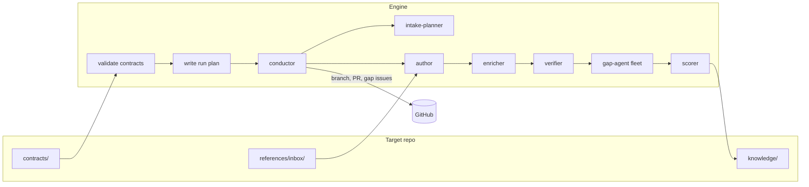

# Archivist

**A contract-driven document engine.** Archivist runs a fixed team of [Claude Code](https://code.claude.com)
agents that author, enrich, verify, gap-check and score knowledge documents in a git repository,
following rules that the repository itself defines.


[](LICENSE)


---

## Table of contents

- [Why Archivist](#why-archivist)
- [How it works](#how-it-works)
- [Features](#features)
- [Quick start](#quick-start)
- [Usage](#usage)
- [Writing a target](#writing-a-target)
- [Configuration](#configuration)
- [Project structure](#project-structure)
- [Development](#development)
- [Contributing](#contributing)
- [Status and roadmap](#status-and-roadmap)
- [License](#license)

## Why Archivist

Knowledge pipelines tend to hard-code one kind of output: one document shape, one routing rule,
one scoring rubric. Every new kind of document then means changing the pipeline itself.

Archivist separates the two halves of the problem:

| | Owns | Lives in |
|---|---|---|
| **Target** (your knowledge repo) | the *what*: document types, structure, intake rules, gap criteria, scoring, reference data | `contracts/` in that repo |
| **Engine** (this repo) | the *how*: a stable team of general-purpose agents and the skills they use | `agents/`, `skills/` |

One engine serves many targets. A new kind of document is a new set of contracts, not an engine
change.

## How it works



1. **Validate.** The engine loads `contracts/target.yaml` and every contract it declares. It checks
   syntax, JSON Schemas and cross-references, and refuses the run if the chosen pipeline needs a
   contract the target did not declare.
2. **Plan.** It installs the engine's agents and skills into the workspace and writes a run plan:
   the stages in order, and how each one is dispatched.
3. **Run.** The conductor agent follows the plan. It takes each group of inbox documents through
   every stage, updates the catalog, and optionally publishes a branch, a pull request and one
   GitHub issue per gap.
4. **Guard.** A run fails if its first stage never started. Python writes a redacted transcript
   for every sub-agent.

Judgement stays with the agents. Python only validates, prepares and launches.

## Features

- **Contracts are optional by default.** Only `contracts/target.yaml` is required. Everything else
  is needed only when an agent in the pipeline requires it.
- **Your own reference data.** Inventories, owner lists, glossaries or anything else can be
  described in the contract index and read by agents, with no engine change.
- **Pipelines from engine agents.** Targets choose, reorder or drop stages. They cannot ship
  agents of their own.
- **Open Knowledge Format output.** Concepts use [OKF v0.2](https://github.com/GoogleCloudPlatform/open-knowledge-format)
  fields where OKF defines them. Every extension field carries the `okfx_` prefix, and validation
  enforces it.
- **Safe parallel gap checks.** One agent per gap kind runs in parallel. Each verdict goes through
  a locked, YAML-safe `record-gap` command, so concurrent agents can't lose each other's findings.
- **Pinned engine versions.** Each target names the engine release it runs on; a newer engine
  hands the run to the pinned release instead of changing a target's behaviour silently.
- **Published for review.** Each run produces one branch and one pull request, with gap issues
  deduplicated by title across re-runs.

## Quick start

### Prerequisites

- [Docker](https://docs.docker.com/get-docker/), the only runtime (on macOS, `colima start`
  if the daemon is down)
- Model access, either an [Anthropic API key](https://console.anthropic.com/) or an
  Anthropic-compatible gateway such as LiteLLM
- A [`gh`](https://cli.github.com/) login on the host for publishing runs

### 1. Clone and configure

```bash
git clone https://github.com/dfirmin/archivist.git
cd archivist
cp .env.example .env        # pick CLAUDE_AUTH_MODE and fill in its variables
```

### 2. Run the offline tests

```bash
./tests/run.sh
```

### 3. Try the example target

```bash
./scripts/docker-run.sh prepare-target --target sample --local /workspace/sample   # seed the bundle
cp -r examples/warehouse/contracts/. out/workspace/sample/contracts/                # add the example contracts
cp examples/warehouse/references/inbox/documents/*.md out/workspace/sample/references/inbox/documents/

./scripts/docker-run.sh validate /workspace/sample --pipeline full
./scripts/docker-run.sh prepare-workspace /workspace/sample   # inspect .claude/ and the run plan

SKIP_PUBLISH=1 \
  INBOX_FILE=references/inbox/documents/catalog-custcase-essential-information.md \
  ./scripts/run-conductor.sh
```

Results appear under `out/workspace/sample/knowledge/`, and transcripts under `out/transcripts/`.

## Usage

All commands run inside the container through the wrappers in `scripts/`.

| Command | What it does |
|---|---|
| `archivist validate <workspace> [--pipeline P …]` | Check a target's contracts against one or more pipelines |
| `archivist prepare-target --target <slug> [--local] <path>` | Seed an empty repo with the minimal bundle and `contracts/target.yaml` |
| `archivist load-target --target <slug> <path>` | Fresh clone of a registered target, then validate (publisher mode) |
| `archivist prepare-workspace <workspace> [--pipeline P]` | Install agents, skills and the run plan into `.claude/` |
| `archivist run-conductor <workspace> […]` | Run the pipeline (live) |
| `archivist record-gap <concept> --kind K …` | Write one gap verdict (used by gap-agents) |
| `archivist smoke-agent` | Prove headless Claude Code can spawn a sub-agent (live) |

Common conductor runs (auth comes from `.env`):

```bash
./scripts/run-conductor.sh                                                        # whole inbox, publish
INBOX_LIMIT=1 SKIP_PUBLISH=1 ./scripts/run-conductor.sh
PIPELINE=gaps SKIP_PUBLISH=1 CONCEPT_FILE='knowledge/…/overview.md' ./scripts/run-conductor.sh
```

`SKIP_PUBLISH=1` leaves git alone. Trusted git operations (`load-target`, remote
`prepare-target`) go through `./scripts/publisher-run.sh`.

## Writing a target

A target is an OKF bundle with a `contracts/` directory:

```
my-knowledge/
├── contracts/
│   ├── target.yaml          # required: slug, pipelines, contract paths, reference data
│   ├── concept-types.yaml   # OKF type, path pattern, structures, okfx_ fields
│   ├── structures/*.yaml    # sections and who owns each one
│   ├── intake.yaml          # scope, grouping, document classes and routing
│   ├── gap-kinds.yaml       # gaps to judge, per concept type
│   ├── scoring.yaml         # confidence rubric
│   └── reference/…          # any data of your own
├── knowledge/               # authored concepts (concept ID = path)
├── references/inbox/        # documents waiting to be authored
├── index.md  log.md         # OKF reserved files
```

| Contract | Required when the pipeline runs | Default without it |
|---|---|---|
| `concept-types`, `structures` | author, enricher (concept-types also for gap-agent) | none |
| `intake` | never | every document in scope, each authored as its own concept |
| `gap-kinds` | gap-agent, scorer | none |
| `scoring` | scorer | none |
| `catalog`, `publishing` | never | index grouped by type; issue title `{title} — {kind}` |

A minimal index:

```yaml
version: 1
slug: policy-notes
engine: v0.1.0                        # the engine release this target runs on
default_pipeline: summarize
pipelines:
  summarize: [author, verifier]       # engine agents only
contracts:
  concept-types: concept-types.yaml
  structures: structures/
```

Two complete examples ship with the engine:

- [`examples/minimal`](examples/minimal): policy summaries from two contracts.
- [`examples/warehouse`](examples/warehouse): data-warehouse business views, with inventory
  routing, code-extracted logic, glossary checks, scoring and issue publishing, all expressed as
  contracts.

Schemas for every contract kind are in [`schemas/contracts/`](schemas/contracts/).

## Engine versions

Every target pins the engine release it runs on, so an engine change never reaches a target
until that target opts in:

```yaml
# contracts/target.yaml
engine: v0.1.0          # a release tag, or a full commit SHA
```

- `prepare-target` writes the pin for you (the engine's own release, or `--engine vX.Y.Z`).
- Every command that works on a target (`validate`, `load-target`, `prepare-workspace`,
  `run-conductor`) checks the pin first. If the running engine is a different version, it
  fetches the pinned release from `ARCHIVIST_ENGINE_REPO` (default: this repository), installs
  it once into `ARCHIVIST_ENGINE_CACHE`, and hands the command to it. Agents calling
  `archivist record-gap` during that run use the pinned engine too.
- **Try** an upgrade for one run with `--engine v0.2.0` (or `ENGINE=v0.2.0` for
  `run-conductor.sh`); `--engine current` uses the installed engine regardless of the pin.
- **Adopt** an upgrade by changing `engine:` in the target repo through a pull request.

Releasing the engine: set `version` in `pyproject.toml` and `src/archivist/__init__.py` to the
release, tag `vX.Y.Z` on that commit, then move `main` to the next `.devN` version. A test keeps
the two version strings equal.

## Configuration

### Model access

Set `CLAUDE_AUTH_MODE` in `.env` (see [`.env.example`](.env.example)):

| Mode | Talks to | Needs |
|---|---|---|
| `anthropic-api` | the Anthropic API directly (`api.anthropic.com`) | `ANTHROPIC_API_KEY` |
| `gateway-key` (default) | a LiteLLM or other Anthropic-compatible gateway | `LITELLM_API_BASE`, `LITELLM_API_KEY`, `LITELLM_MODEL` |
| `local-claude` | whatever your own Claude Code login uses (local dev) | a host `~/.claude-code-auth` apiKeyHelper, `ACT_CLAUDE_MODEL` |
| `inherit` | whatever the installed Claude Code is already signed in to: a `/login`, a subscription token from `claude setup-token` (`CLAUDE_CODE_OAUTH_TOKEN`), or a Claude Code cloud session | nothing; Archivist leaves the environment alone |

```bash
# Direct Anthropic API
CLAUDE_AUTH_MODE=anthropic-api
ANTHROPIC_API_KEY=sk-ant-...
```

In `anthropic-api` mode Archivist removes any gateway URL, bearer token or beta-header
stripping from the environment before starting Claude Code, so a leftover gateway setting can't
silently reroute the run. Gateway mode strips pre-release beta headers, which many gateways
reject. Each agent pins its own model in `agents/*.md`; `ACT_CLAUDE_MODEL` sets the session
default. Run `./scripts/docker-run.sh config-check` to see which endpoint a run will use.

### Other variables

| Variable | Purpose |
|---|---|
| `ACT_CLAUDE_MODEL` | Default session model (optional in `anthropic-api` mode) |
| `ANTHROPIC_BASE_URL` | Gateway mode only: a local proxy in front of the gateway |
| `GITHUB_TOKEN` | Used by the conductor for publishing (or the mounted `gh` login) |

`run-conductor.sh` also reads `TARGET_SLUG`, `WORKSPACE`, `PIPELINE`, `INBOX_FILE`,
`INBOX_LIMIT`, `GROUP_LIMIT`, `CONCEPT_FILE`, `SKIP_PUBLISH` and `RUN_BRANCH`.

Targets are registered in [`targets.yaml`](targets.yaml).

## Project structure

```
agents/             engine agents and profile.yaml (team, requirements, dispatch, pipelines)
skills/             engine skills, one concept each
schemas/contracts/  JSON Schema per contract kind
src/archivist/      contract validation, roster and run plan, runner, record-gap, CLI
bundle-template/    what prepare-target seeds into a new target
examples/           example targets (minimal, warehouse)
tests/              offline tests for the deterministic code
docs/adr/           architecture decisions
```

## Development

```bash
pip install -e ".[dev]"     # Python 3.12+
python -m pytest -q         # or ./tests/run.sh inside Docker
```

Offline tests cover deterministic code only: contract validation, roster resolution, the run
plan, `record-gap` and the run guards. Agent changes are proven by a **live** run on a real
target, inspected by hand. [`AGENTS.md`](AGENTS.md) lists what each agent must show.

## Contributing

1. Read [`AGENTS.md`](AGENTS.md) for the rules (agentic first; domain lives in contracts;
   targets ship contracts only) and [`CONTEXT.md`](CONTEXT.md) for vocabulary.
2. Open an issue describing the change. Triage labels: `needs-triage`, `needs-info`,
   `ready-for-agent`, `ready-for-human`, `wontfix`.
3. Keep tests green, and attach live-run evidence for any agent, skill or dispatch change.
4. Record any new deterministic step in [`docs/adr/`](docs/adr/).

## Status and roadmap

Early development. The deterministic layer is tested, and the full pipeline has run live on both
example targets ([evidence](docs/live-proof/2026-10-04.md)).

- [x] Live proof on `examples/warehouse` and `examples/minimal`
- [ ] Live proof of publishing (branch, PR, gap issues) and of `code-logic` enrichment
- [ ] Live proof in `anthropic-api` and `gateway-key` modes, inside Docker
- [ ] Glossary reconciliation agent
- [ ] CI for the offline test suite

## License

Released under the [MIT License](LICENSE).
